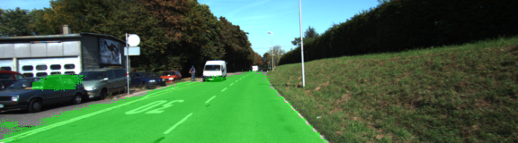

# Semantic Segmentation
### Introduction
In this project, you'll label the pixels of a road in images using a Fully Convolutional Network (FCN).

The project FCN is based on an VGG-16 image classifier architecture to perform semantic segmentation 
to identify road area pixels (KITTI data set).

### Network Architecture:
A pre-trained VGG-16 network is provided and was converted to a FCN,
adding additional layers, using upsample technique and connections skip. 
The upsampling is done using transpose convolutioins operations, which includes a regularizer 
to improve pixels clasifitacion precision.

### Optimizer:
The loss function is cross-entropy and the optimizer is Adam.

### Training:
The selected hyperparameters for training are the following:

keep_prob: 0.5
learning_rate: 0.001
epochs: 5
batch_size: 10
Results
Final Loss for Epoch 5 was 0.11, which looks a bit large but the results are quite acceptable.
The small number of epochs and large learning rate were selected to train fast with CPU, because 
the GPU RAM was not enought (about 5Gb were used by the proecess), and with an I7 7700 each Epoch 
takes about 5 minutes, so the FCN was trained in about 25 minutes.

With a GPU with more RAM, a learning rate of 0.0005 would be selected and at least 20 Epochs.
Anyway the positive aspect is that with such a large learning rate overfitting was completelly prevented,
and the model generalized quite well, a key for this problem.

The following are the sample images:





### Setup
##### Frameworks and Packages
Make sure you have the following is installed:
 - [Python 3](https://www.python.org/)
 - [TensorFlow](https://www.tensorflow.org/)
 - [NumPy](http://www.numpy.org/)
 - [SciPy](https://www.scipy.org/)
##### Dataset
Download the [Kitti Road dataset](http://www.cvlibs.net/datasets/kitti/eval_road.php) from [here](http://www.cvlibs.net/download.php?file=data_road.zip).  Extract the dataset in the `data` folder.  This will create the folder `data_road` with all the training a test images.

### Start
##### Implement
Implement the code in the `main.py` module indicated by the "TODO" comments.
The comments indicated with "OPTIONAL" tag are not required to complete.
##### Run
Run the following command to run the project:
```
python main.py
```
**Note** If running this in Jupyter Notebook system messages, such as those regarding test status, may appear in the terminal rather than the notebook.

### Submission
1. Ensure you've passed all the unit tests.
2. Ensure you pass all points on [the rubric](https://review.udacity.com/#!/rubrics/989/view).
3. Submit the following in a zip file.
 - `helper.py`
 - `main.py`
 - `project_tests.py`
 - Newest inference images from `runs` folder  (**all images from the most recent run**)
 
 ### Tips
- The link for the frozen `VGG16` model is hardcoded into `helper.py`.  The model can be found [here](https://s3-us-west-1.amazonaws.com/udacity-selfdrivingcar/vgg.zip)
- The model is not vanilla `VGG16`, but a fully convolutional version, which already contains the 1x1 convolutions to replace the fully connected layers. Please see this [forum post](https://discussions.udacity.com/t/here-is-some-advice-and-clarifications-about-the-semantic-segmentation-project/403100/8?u=subodh.malgonde) for more information.  A summary of additional points, follow. 
- The original FCN-8s was trained in stages. The authors later uploaded a version that was trained all at once to their GitHub repo.  The version in the GitHub repo has one important difference: The outputs of pooling layers 3 and 4 are scaled before they are fed into the 1x1 convolutions.  As a result, some students have found that the model learns much better with the scaling layers included. The model may not converge substantially faster, but may reach a higher IoU and accuracy. 
- When adding l2-regularization, setting a regularizer in the arguments of the `tf.layers` is not enough. Regularization loss terms must be manually added to your loss function. otherwise regularization is not implemented.
 
### Using GitHub and Creating Effective READMEs
If you are unfamiliar with GitHub , Udacity has a brief [GitHub tutorial](http://blog.udacity.com/2015/06/a-beginners-git-github-tutorial.html) to get you started. Udacity also provides a more detailed free [course on git and GitHub](https://www.udacity.com/course/how-to-use-git-and-github--ud775).

To learn about REAMDE files and Markdown, Udacity provides a free [course on READMEs](https://www.udacity.com/courses/ud777), as well. 

GitHub also provides a [tutorial](https://guides.github.com/features/mastering-markdown/) about creating Markdown files.
